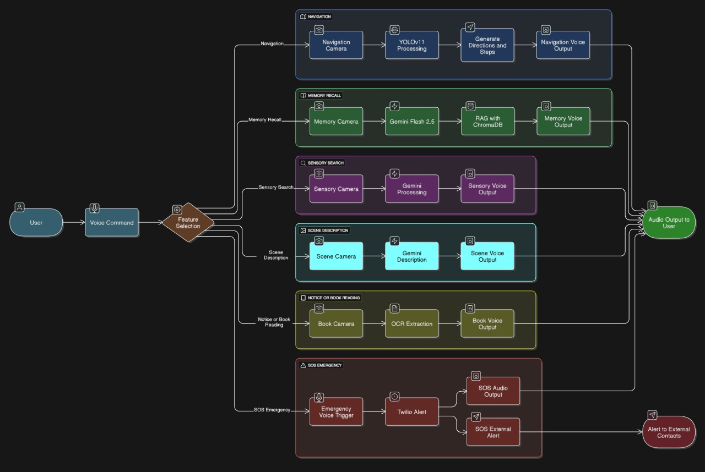
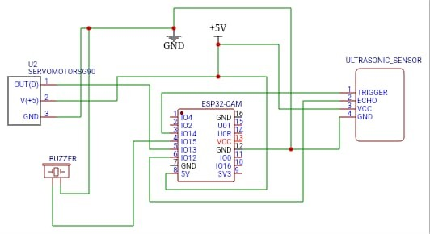

# AI Eye Assistant

A comprehensive AI-powered visual assistance system that provides scene analysis, object recognition, text extraction, face recognition, navigation assistance, and emergency services.

## Features

- **Scene Analysis**: Describe environments and scenes using computer vision
- **Object Recognition**: Identify objects and provide purchase recommendations
- **Text Extraction**: Extract text from images using OCR capabilities
- **Face Recognition**: Register and recognize faces
- **Navigation Assistance**: Provide guidance and route information
- **Emergency Services**: Send SOS messages with location information
- **Document Analysis**: RAG-based document processing and Q&A
- **Video Analysis**: Frame-by-frame analysis with face recognition
- **Speech Interface**: Voice input and text-to-speech output

## Project Structure

```
aeye/
├── main.py                          # Main application entry point
├── config.py                        # Configuration management
├── requirements.txt                 # Python dependencies
├── .env                            # Environment variables (create this)
└── modules/
    ├── speech_manager.py           # Speech recognition and synthesis
    ├── iot_controller.py           # Camera and servo control
    ├── scene_analyzer.py           # Scene description and analysis
    ├── object_recognizer.py        # Object recognition and recommendations
    ├── text_extractor.py           # Text extraction from images
    ├── emergency_handler.py        # Emergency SOS functionality
    ├── face_recognition.py         # Face detection and recognition
    ├── navigation_assistant.py     # Navigation and route guidance
    ├── document_analyzer.py        # Document processing and RAG
    └── video_analyzer.py           # Video frame analysis
```

## Installation

1. **Clone the repository**:
   ```bash
   git clone <repository-url>
   cd aeye
   ```

2. **Install dependencies**:
   ```bash
   pip install -r requirements.txt
   ```

3. **Create environment file**:
   Create a `.env` file in the root directory with your API keys:
   ```env
   # Google Gemini API
   GEMINI_API_KEY=your_gemini_api_key_here
   
   # Groq API
   GROQ_API_KEY=your_groq_api_key_here
   
   # Twilio Configuration
   TWILIO_ACCOUNT_SID=your_twilio_account_sid
   TWILIO_AUTH_TOKEN=your_twilio_auth_token
   TWILIO_PHONE_NUMBER=your_twilio_phone_number
   EMERGENCY_PHONE_NUMBER=your_emergency_phone_number
   
   # Google Cloud Speech-to-Text
   GOOGLE_APPLICATION_CREDENTIALS=path_to_your_service_account_key.json
   ```

4. **Place your Google Cloud service account key**:
   - Copy your `elated-yen-446113-a9-e3c6f3910fa2.json` file to the `modules/` directory
   - Or update the path in `config.py` to point to your key file

## Usage

### Running the Application

```bash
python main.py
```

### Voice Commands

The system responds to the following voice commands:

- **Scene Description**: "describe scene", "what do you see", "describe what you're seeing"
- **Object Recognition**: "what am I holding", "search for this", "what is this object"
- **Text Extraction**: "read this", "extract text", "what does this say"
- **Emergency**: "SOS", "emergency", "help"
- **Face Recognition**: "register face", "recognize face"
- **Navigation**: "navigate", "show me the way", "route guidance"
- **Exit**: "exit" to quit the application

### Architecture Diagram


### Block Diagram of Embed System


### Module Functions

#### Speech Manager (`speech_manager.py`)
- `get_voice_input()`: Capture and transcribe voice input
- `speak_text(text)`: Convert text to speech

#### IoT Controller (`iot_controller.py`)
- `get_frame()`: Capture image from camera
- `set_servo_angle(angle)`: Control servo motor

#### Scene Analyzer (`scene_analyzer.py`)
- `analyze_scene()`: Generate scene descriptions using AI

#### Object Recognizer (`object_recognizer.py`)
- `recognize_object()`: Identify objects and provide recommendations
- `handle_follow_up_queries(context)`: Answer follow-up questions

#### Text Extractor (`text_extractor.py`)
- `extract_text()`: Extract text from images using OCR
- `extract_text_with_context(context)`: Extract specific types of text
- `extract_structured_data()`: Extract organized data from images

#### Emergency Handler (`emergency_handler.py`)
- `send_sos_message()`: Send emergency SOS message
- `send_custom_emergency_message(message)`: Send custom emergency message
- `check_emergency_contacts()`: Verify emergency contact configuration

#### Face Recognition (`face_recognition.py`)
- `register_new_face()`: Register a new face with name
- `recognize_registered_faces()`: Recognize previously registered faces
- `get_registered_faces()`: List all registered faces

#### Navigation Assistant (`navigation_assistant.py`)
- `analyze_environment()`: Analyze current environment for navigation
- `provide_navigation_guidance(destination)`: Provide route guidance
- `interactive_navigation()`: Interactive navigation session

#### Document Analyzer (`document_analyzer.py`)
- `analyze_document(file_path)`: Process documents for analysis
- `interactive_document_qa(db)`: Interactive Q&A session
- `generate_answer(db, query)`: Generate answers from document database

#### Video Analyzer (`video_analyzer.py`)
- `start_video_analysis()`: Start video frame analysis
- `capture_frames()`: Capture frames at intervals
- `describe_frames()`: Generate descriptions for captured frames

## Configuration

### Camera Settings
- Default camera index: 0 (webcam)
- ESP32-CAM fallback URL: Configured in `iot_controller.py`
- Servo control: Configured for ESP32 servo control

### AI Model Settings
- **Gemini**: Used for scene analysis, object recognition, and navigation
- **Groq**: Used for text extraction and OCR
- **Google Cloud Speech**: Used for speech-to-text conversion

### Face Recognition Settings
- Detection scale factor: 1.1
- Minimum neighbors: 5
- Minimum face size: 30x30 pixels
- Output directory: `known image/`

## Error Handling

All modules include comprehensive error handling:
- API key validation
- Camera access fallbacks
- Network request timeouts
- File operation safety
- Temporary file cleanup

## Dependencies

### Core Dependencies
- `opencv-python`: Computer vision and image processing
- `PIL`: Image manipulation
- `google-generativeai`: Gemini AI integration
- `groq`: Groq AI integration
- `twilio`: SMS messaging
- `pyaudio`: Audio recording
- `pyttsx3`: Text-to-speech
- `google-cloud-speech`: Speech recognition

### Additional Dependencies
- `chromadb`: Vector database for document analysis
- `pypdf`: PDF processing
- `face-recognition`: Face detection and recognition
- `fpdf`: PDF generation
- `moviepy`: Video processing

## Troubleshooting

### Common Issues

1. **Camera Access Error**:
   - Ensure camera permissions are granted
   - Check if another application is using the camera
   - Verify camera index in `iot_controller.py`

2. **API Key Errors**:
   - Verify all API keys are correctly set in `.env`
   - Check API key validity and quotas
   - Ensure service account files are properly placed

3. **Audio Issues**:
   - Check microphone permissions
   - Verify audio device configuration
   - Test with different audio input devices

4. **Module Import Errors**:
   - Ensure all dependencies are installed
   - Check Python path and virtual environment
   - Verify module file names match imports

### Performance Optimization

- Use appropriate camera resolution for your use case
- Adjust face detection parameters for better performance
- Monitor API usage to avoid rate limits
- Use SSD storage for faster file operations

## Contributing

1. Fork the repository
2. Create a feature branch
3. Make your changes with proper documentation
4. Test thoroughly
5. Submit a pull request

## License

This project is licensed under the MIT License - see the LICENSE file for details.

## Support

For support and questions:
- Create an issue in the repository
- Check the troubleshooting section
- Review the module documentation

## Changelog

### Version 2.0.0
- Complete module restructuring and renaming
- Added comprehensive documentation
- Externalized configuration to environment variables
- Improved error handling and logging
- Added new functionality for video analysis and document processing